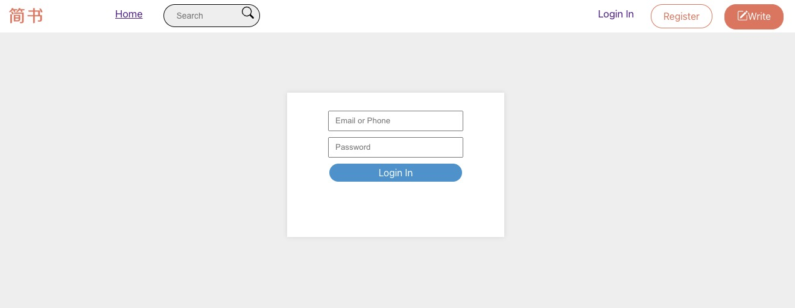
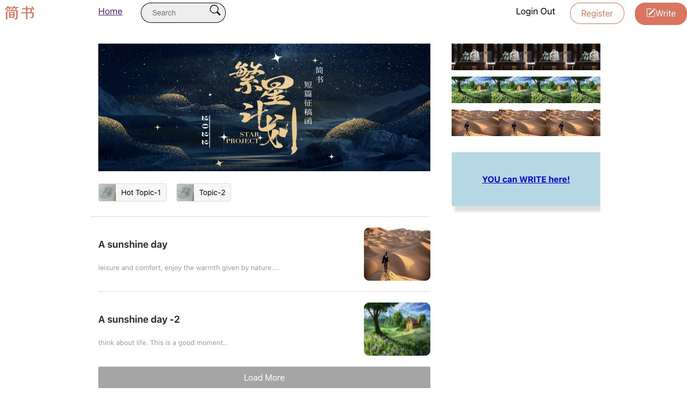
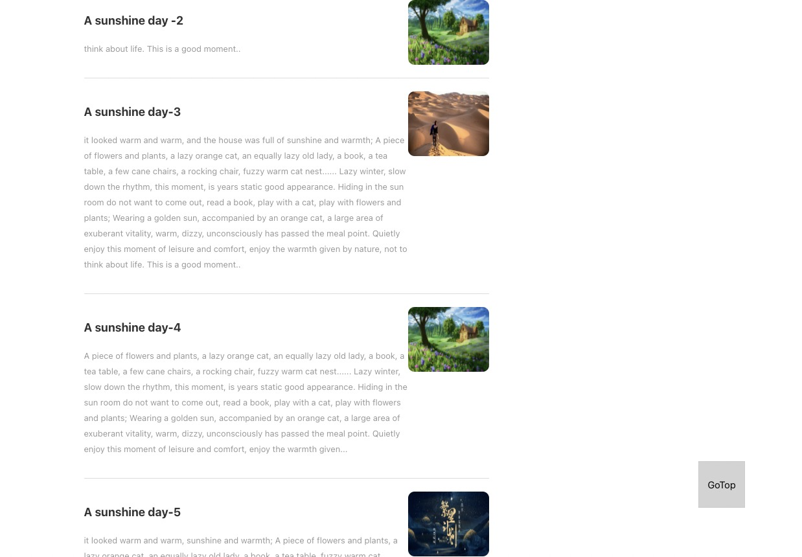
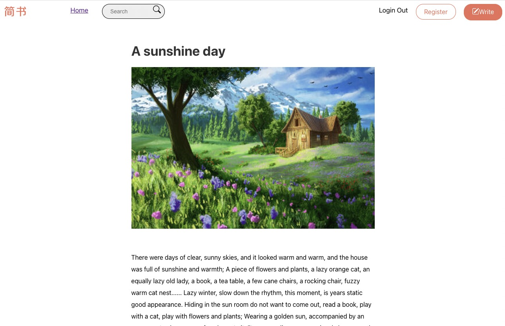

# Phone-Store

## Description:

This is a blog website that provides home page including article list, topic list, search part, recommend list, and detail page, write page.

\
 
\

## Table of Contents

1. [Technical Features](#tech)
   - [how to start?](#start)
2. [User Guidelines](#user)

   - [login part](#login)
   - [Home page](#home)
   - [load more part](#more)
   - [detail page](#detail)

3. [What did I learn?](#learn)
   - [Lessons Learned](#lessons)
4. [Future Work](#future)

## Technical Features 

#### how to start? 

- This project was created by 'Create React App' script.

- To run the app in development mode, you can run from project directory:

`npm start`

- Runs the app in the development mode.Open http://localhost:3000 to view it in your browser.
- The page will reload when you make changes.

## User Guidelines 

### login part 

- In this login page, users can input their email and password to login.
- When login in successfully, they can go to home page.

### Home page 

- In the home page, it shows article list, topic list, search part, recommend list part.
- Users can click 'loading more' button to get more aticles in this page.

### load more part 

- When users click loading more and get more articles, the 'goTop' button will not hide any more.
- Users can click 'goTop' button to go to top part, which used the method of 'window.scrollTo(0, 0)'.

### detail page 

- When users click the article in home page, it will bring users to detail page to view the
  article in detail.

## What did I learn?

#### Delopyment

- I use this section to deploy live pages in Github: [https://facebook.github.io/create-react-app/docs/deployment](https://facebook.github.io/create-react-app/docs/deployment)

- I also use [Netlify](https://www.netlify.com/?utm_source=google&utm_medium=paid_search&utm_campaign=12755510784&adgroup=118788138897&utm_term=netlify&utm_content=kwd-371509120223&creative=514583565825&device=c&matchtype=e&location=9071326&gclid=Cj0KCQjwg_iTBhDrARIsAD3Ib5j3qovL2scHdTLIhKf6BPgQfvjSfufkbBwjZOTySxzgjB4NOpgngKIaArspEALw_wcB) to deploy live pages using Github repo's existing project.

- When I met deploy errors, I followed this video to correct my error. Finally, I deployed my live page successfully after following the author's advice.[CI= yarn run build]

- [PedroTech](https://www.youtube.com/watch?v=8KGLOJHqNMg)
  In his video, he show us how to deploy a react js application to Netlify. It is very easy to do this, and it allows continuous deployment through github!

#### Code Splitting

- I learned how to split code into different folders to get best practice.
  This section has moved here: [https://facebook.github.io/create-react-app/docs/code-splitting](https://facebook.github.io/create-react-app/docs/code-splitting)

#### npm run build

- I use 'npm run build' to bundles React in production mode, which can optimize the build to get the best performance.
  Builds the app for production to the `build` folder.
  The build is minified and the filenames include the hashes.
  After build, the app is ready to be deployed!
  See the section about [deployment](https://facebook.github.io/create-react-app/docs/deployment) for more information.

#### create-react-app

- I learned how to use 'create-react-app' to build small projects, and how to install node-modules before start the project.

#### used skills.

- I use this phone store project to practice my 'redux' skills. I created a new git branch named 'redux', and use **redux** such as 'mapStateToProps', 'mapDispatchToProps' to get global
  states and methods, then passing them to components which needed to use those global states.
- I use '**styled-components**' to render CSS style.
- I learn how to load more article list and how to hide and show 'go to top' button using '**document.documentElement.scrollTop**' and **window.scrollTo(0, 0)**
- I learn how to create action, reducer and constants types in redux.

## Improvements 

- will add some **react-icons** and use some UI libraries such as Ant Design or Material UI to render the style.
- will import **google-fonts** to create different word format.
- will write test code using **'JEST'** for this project.
- I will add more functions or contents in detail page.
- I will make my project more responsive in different size of devices.
- I will use MERN back end methods to store the users' information.
- I will build more projects to improve my skills.

`npm test`

- Launches the test runner in the interactive watch mode.
  See the section about [running tests](https://facebook.github.io/create-react-app/docs/running-tests) for more information.

`Learn More`

- You can learn more in the [Create React App documentation](https://facebook.github.io/create-react-app/docs/getting-started).
